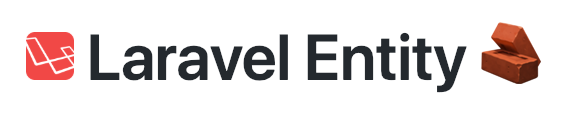
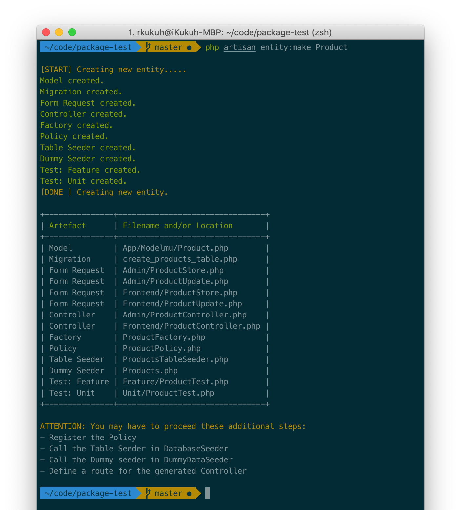

<p align="center"></p>

<p align="center">This readme is written in Bahasa. <a href="https://github.com/bukankalengkaleng/laravel-entity/blob/master/README.EN.md">English version is here</a></p>

---

| Development | Code Quality | Release | 
| :---------: | :----------: | :-----: |
| [](https://travis-ci.org/bukankalengkaleng/laravel-entity) <br> [](https://codeclimate.com/github/bukankalengkaleng/laravel-entity/maintainability) <br> [](https://codeclimate.com/github/bukankalengkaleng/laravel-entity/test_coverage) | [](https://scrutinizer-ci.com/g/bukankalengkaleng/laravel-entity/?branch=master) <br> [](https://codecov.io/gh/bukankalengkaleng/laravel-entity) <br> [](https://scrutinizer-ci.com/code-intelligence) | [](https://packagist.org/packages/bukankalengkaleng/laravel-entity) <br> [](https://packagist.org/packages/bukankalengkaleng/laravel-entity) <br> [](https://packagist.org/packages/bukankalengkaleng/laravel-entity) | 

## Deskripsi

Artisan *command* untuk membuat entitas yang lengkap.

## Motivasi

Membuat entitas (contoh: *Product, Employee*, dsb) yang lengkap (ada *Model, Factory, Migration, Form Requests, Feature / Unit tests, Policy*, dan *Controller*-nya) akan memakan waktu jika dilakukan manual. Artisan *command* ini akan mempercepatnya.

## Instalasi

```
composer require bukankalengkaleng/laravel-entity
```

Laravel v5.5 dan keatas akan otomatis meregistrasi package ini. Jika kamu menggunakan versi dibawah itu, kamu perlu melakukannya secara manual dalam file `config/app.php`:

```php
'providers' => [
    // ...
    BukanKalengKaleng\LaravelEntity\LaravelEntityServiceProvider::class,
];
```

## Cara Menggunakan

1. Jalankan perintah
    ```
    php artisan entity:make Product
    ```
1. Kamu akan dapatkan entitas **Product** yang lengkap:
    - app/Models/**Product.php**
    - database/migrations/**create_products_table.php**
    - database/factories/**ProductFactory.php**
    - database/seeds/**ProductsTableSeeder.php**
    - database/seeds/dummies/**Products.php**
    - app/Http/Controllers/Admin/**ProductController.php**
    - app/Http/Controllers/Frontend/**ProductController.php**
    - app/Http/Requests/Admin/**ProductStore.php**
    - app/Http/Requests/Admin/**ProductUpdate.php**
    - app/Http/Requests/Frontend/**ProductStore.php**
    - app/Http/Requests/Frontend/**ProductUpdate.php**
    - app/Policies/**ProductPolicy.php**
    - app/tests/Feature/**ProductTest.php**
    - app/tests/Unit/**ProductTest.php**

     

Namespaces entitas (`Admin` dan `Frontend`) dapat diatur dalam file `config/entity.php` yang harus kamu publish dahulu dengan cara:

```
php artisan vendor:publish --tag="laravel-entity"
```

## Roadmap

Untuk mengetahui rencana kedepan package ini silahkan membaca [Roadmap](https://github.com/bukankalengkaleng/laravel-entity/blob/master/ROADMAP.md).

## Kontribusi

1. Kirim PR
1. Gak perlu baper kalo PR tertolak

## Catatan Revisi

Catatan revisi dapat dilihat di [Changelog](https://github.com/bukankalengkaleng/laravel-entity/blob/master/CHANGELOG.md) ini.

## Lisensi

Lisensi dari package ini adalah MIT License (MIT). Silahkan lihat bagian [Lisensi](https://github.com/bukankalengkaleng/laravel-entity/blob/master/LICENSE.md) ini untuk lebih jelasnya.
